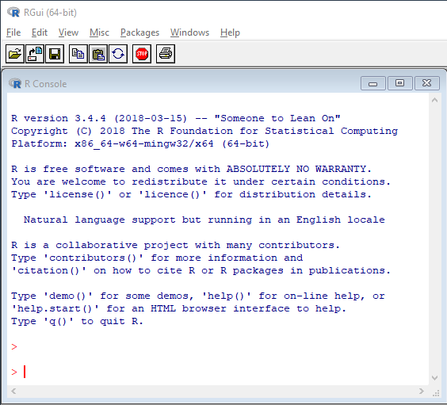
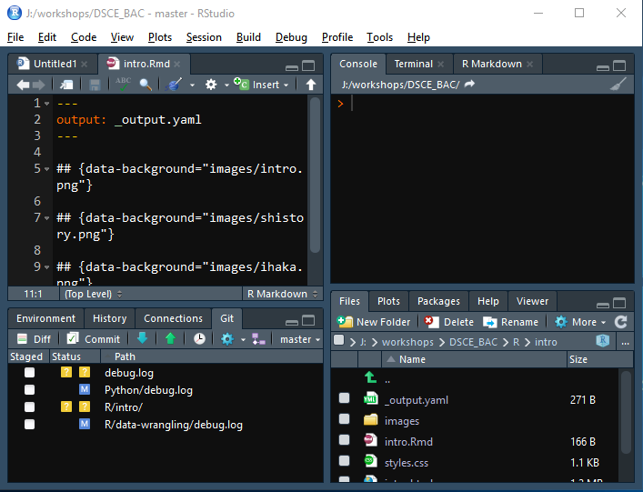

# Introduction {#intro}

## Overview

R is a free and open source programming language widely used in academia, 
industry and government organisations for data science and machine learning. 
R is well suited for interactive data analysis, visualization and modeling. To
view a list of organizations using R, click [here](https://github.com/ThinkR-open/companies-using-r).

Before we talk about R, let us learn a bit about the [S](https://en.wikipedia.org/wiki/S_(programming_language)) 
language, which was the predecessor to R. It was developed by Richard Becker, 
John Chambers and Allan Wilks at the Bell Laboratories. R is a modern 
implementation of S.

R itself was written by [Ross Ihaka](https://www.stat.auckland.ac.nz/~ihaka/) 
and [Robert Gentleman](https://www.linkedin.com/in/robert-gentleman-06845098) 
at the University of Auckland. The development of R was started in 1992 and an 
initial version was released in 1995. Version 1.0 was released in February 
2000. Version 2.0 was released in October 2004. The latest version, R 3.5.2 was 
released in December 2018.

R is released under GNU GPL license and is currently one of the most popular
tools for data science and machine learning. You can find more details and
information related to R at the official [website](https://www.r-project.org/) 
of the R project. You can download R, learn more about the R foundation, its 
members, activities, get the latest news about R and also donate to the 
R foundation.

## Organizations

### R Foundation

R foundation is a not for profit organization founded by the members of the 
R core team and is responsible for the continued development of R. It also 
supports the annual useR conferences. You can learn more about the R foundation
[here](https://www.r-project.org/foundation/).

### R Consortium

R consortium provides support to the R foundation and other key organizations
and groups developing, maintaining and using R. It funds projects that improves
the infrastructure around R and provides support to conferences and user groups
around the world. You can learn more about R consortium [here](https://www.r-consortium.org/).


## Installation

R is available for Windows, Mac and is part of a many Linux distributions. You 
can download and install R from any of the CRAN mirrors listed [here](https://cran.r-project.org/mirrors.html).

### CRAN

[CRAN](https://cran.r-project.org/mirrors.html) stands for **C**omprehensive **R** 
**A**rchive **N**etwork and you can download R and user contributed packages 
from here for different operating systems. CRAN is pronounced as KRAN or C-RAN.


### Extensions

User contributed packages can be downloaded from

- [CRAN](https://cran.r-project.org/mirrors.html)
- [Bioconductor](https://bioconductor.org/)
- [GitHub](https://github.com/topics/r?l=r)
- [R Forge](https://r-forge.r-project.org/)

## GUI

### R GUI

R comes with a simple GUI with sufficient features for data analysis and 
visualization.

```{r gui, fig.align='center', echo=FALSE}

```

### RStudio

[RStudio](https://www.rstudio.com/) is a very popular IDE (integrated development environment)
built to suit the data science work flow.

```{r rstudio, fig.align='center', echo=FALSE}

```


