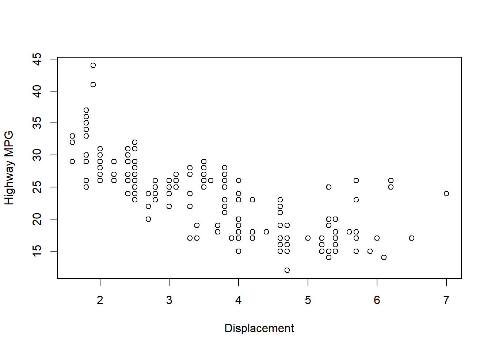
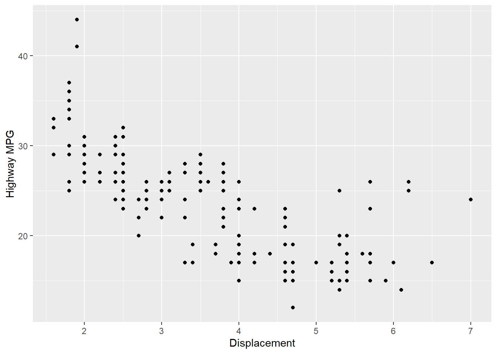

# Your First Visualization {#first-plot}

> **Learning Objectives:** After this chapter you will be able to:
> - Load `ggplot2` and its bundled `mpg` dataset.
> - Draw the same scatterplot in base R and in ggplot2.
> - Describe a plot as data + aesthetics + geometry.


``` r
library(ggplot2)
```

```
## Warning: package 'ggplot2' was built under R version 4.5.3
```

``` r
# ggplot2 bundles the `mpg` dataset (MIT license, same as ggplot2 itself)
data(mpg, package = "ggplot2")
```

> **Common Mistake:** Base R has no `mpg` dataset (it has `mtcars`).
> `plot(mpg$displ, mpg$hwy)` without `library(ggplot2)` fails with
> `object 'mpg' not found`. Always load `ggplot2` first.

## Base R graphics


``` r
plot(mpg$displ, mpg$hwy, xlab = "Displacement", ylab = "Highway MPG")
```



## ggplot2 graphics


``` r
ggplot(mpg, aes(x = displ, y = hwy)) +
  geom_point() +
  labs(x = "Displacement", y = "Highway MPG")
```



**Mental model:** every ggplot is *data* (`mpg`) + *aesthetics* (`aes(x, y)`)
+ *geometry* (`geom_point()`). Change the geometry, keep the mapping.

## Practice Check

**Knowledge Check:** *Data + aesthetics + geometry*
In `ggplot(mpg, aes(x = displ, y = hwy)) + geom_point()`, which part is the
data, which is the aesthetics mapping, and which is the geometry?

<details>
<summary>Click to reveal answer</summary>

**Answer:** Data: `mpg`. Aesthetics: `aes(x = displ, y = hwy)`.
Geometry: `geom_point()`.

*Explanation:* `ggplot()` takes the data and the variable mapping;
each `geom_*()` layer decides how those mapped variables are drawn.
</details>

**Knowledge Check:** *Why `library(ggplot2)` comes first*
What error do you get from `plot(mpg$displ, mpg$hwy)` in a fresh R session,
and why?

<details>
<summary>Click to reveal answer</summary>

**Answer:** `object 'mpg' not found` — base R has no `mpg` dataset (it has
`mtcars`); `mpg` only exists after `library(ggplot2)` (or
`data(mpg, package = "ggplot2")`).

*Explanation:* Datasets live inside packages. Until the package is loaded,
its data is invisible to your session.
</details>

**Knowledge Check:** *Changing the geometry*
How would you turn the scatterplot into a smoothed trend line plot without
changing the data or the variable mapping?

<details>
<summary>Click to reveal answer</summary>

**Answer:** Replace `geom_point()` with `geom_smooth()` (or add it as a
second layer).

*Explanation:* Data + aesthetics stay fixed while geometries are
interchangeable layers — that is the point of the grammar of graphics.
</details>

**Knowledge Check:** *Aesthetics mapping*
In `aes(x = displ, y = hwy)`, what do `x` and `y` refer to — plot labels or
dataset columns?

<details>
<summary>Click to reveal answer</summary>

**Answer:** Dataset columns: `mpg$displ` mapped to horizontal position, `mpg$hwy`
to vertical position.

*Explanation:* `aes()` maps columns of the data to visual properties. Labels
are set separately with `labs()`.
</details>

**Knowledge Check:** *Base R vs ggplot2*
The base R call repeats `mpg$` twice; the ggplot2 call mentions `mpg` once.
Why is that difference useful as plots get more complex?

<details>
<summary>Click to reveal answer</summary>

**Answer:** Declaring the data once in `ggplot(mpg, ...)` means every layer
inherits it — you never retype the data source per variable, so longer plots
stay readable and less error-prone.

*Explanation:* One data declaration shared across layers beats repeating
`data$column` for every variable, especially with facets and multiple geoms.
</details>
